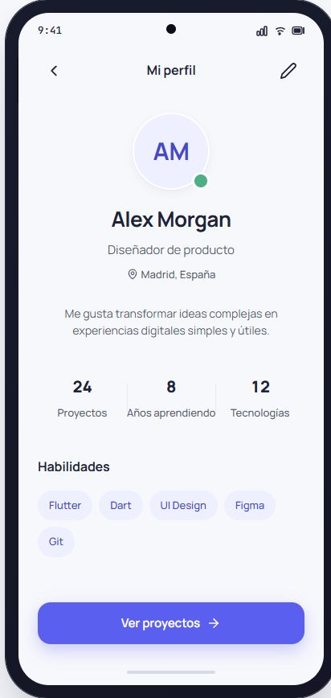

# MiniProyecto 1 — Tarjeta de perfil

Primer proyecto de la serie **Mini proyectos Flutter**. Consistirá en una aplicación Android de una sola pantalla que mostrará un perfil ficticio con una jerarquía visual clara y una composición adaptable.

> Estado actual: mockup preliminar exportado desde OpenDesign. La aplicación Flutter todavía no se ha inicializado.

## Mockup



El diseño de referencia utiliza un dispositivo de 390 × 844 px, orientación vertical, modo claro y `SafeArea`. La captura se considera preliminar mientras OpenDesign termina el documento de especificación.

## Objetivo de aprendizaje

Practicar los fundamentos de construcción de interfaces en Flutter mediante un resultado pequeño y reconocible:

- composición de widgets de fuera hacia dentro;
- distribución, alineación y espaciado;
- avatar circular con indicador de estado;
- jerarquía tipográfica;
- colores y formas con Material 3;
- componentes visuales reutilizables;
- adaptación a móviles Android pequeños y grandes;
- estado visual normal y pulsado de un botón.

## Alcance funcional

La primera versión será deliberadamente estática:

- una sola pantalla titulada **Mi perfil**;
- datos ficticios definidos localmente;
- botón **Ver proyectos** con feedback visual, sin navegación real;
- iconos de volver y editar sin lógica funcional;
- sin login, backend, persistencia, menú inferior ni pantallas adicionales.

## Contenido de la pantalla

La composición seguirá este orden:

```text
ProfileAppBar
→ ProfileHeader
  → AvatarStatus
  → nombre, profesión y ubicación
→ descripción personal
→ ProfileStats
→ habilidades en Wrap
  → SkillChip
→ PrimaryButton
```

Datos de referencia:

| Elemento | Contenido |
|---|---|
| Nombre | Alex Morgan |
| Profesión | Diseñador de producto |
| Ubicación | Madrid, España |
| Descripción | Me gusta transformar ideas complejas en experiencias digitales simples y útiles. |
| Estadísticas | 24 proyectos · 8 años aprendiendo · 12 tecnologías |
| Habilidades | Flutter · Dart · UI Design · Figma · Git |

## Componentes previstos

| Componente | Responsabilidad | Widgets Flutter principales |
|---|---|---|
| `ProfileAppBar` | Barra superior con volver, título y edición | `SafeArea`, `Row`, `IconButton` |
| `AvatarStatus` | Avatar de 96 px e indicador activo | `Stack`, `CircleAvatar` |
| `ProfileHeader` | Identidad, profesión y ubicación | `Column`, `Text`, `Icon` |
| `ProfileStats` | Tres estadísticas distribuidas por igual | `Row`, `Expanded`, `VerticalDivider` |
| `SkillChip` | Etiqueta visual reutilizable | `Container`, `Text` |
| `PrimaryButton` | Acción principal y estado pulsado | `FilledButton`, `Icon` |

## Sistema visual

### Colores

| Rol | Valor |
|---|---|
| Fondo | `#F7F8FC` |
| Superficie | `#FFFFFF` |
| Texto principal | `#202338` |
| Texto secundario | `#74788F` |
| Principal | `#5B5FEF` |
| Principal pulsado | `#4548C8` |
| Lavanda suave | `#EEEFFF` |
| Borde | `#E7E8F0` |
| Estado activo | `#4CAF88` |

### Tipografía y espaciado

- Familia: Manrope, con pesos 400, 500, 600, 700 y 800 según el rol.
- Nombre: 26 px y peso 700.
- Texto descriptivo: 14 px con altura de línea de 21 px.
- Estadísticas: 20 px y peso 800.
- Márgenes laterales: 24 px.
- Separación entre secciones: 28–32 px.
- Separación entre chips: 8 px.
- Botón: 52 px de alto y radio de 16 px.

## Datos técnicos previstos

| Propiedad | Valor |
|---|---|
| Nombre visible | Tarjeta de Perfil |
| Título de pantalla | Mi perfil |
| Paquete Dart | `mini_proyecto_1_tarjeta_perfil` |
| Identificador Android | `com.example.tarjeta_perfil` |
| Plataformas | Android |
| Diseño | OpenDesign · Soft Premium |

## Estructura prevista

La estructura se mantendrá sencilla y feature-first. No habrá capas de dominio o datos porque esta primera versión no contiene reglas de negocio ni fuentes externas:

```text
lib/
├── main.dart
├── app/
│   └── profile_app.dart
└── features/
    └── profile/
        └── presentation/
            ├── pages/
            │   └── profile_page.dart
            └── widgets/
```

## Cómo ejecutar

Estas instrucciones serán aplicables cuando se inicialice la aplicación:

```bash
flutter pub get
flutter devices
flutter run
```

## Próximos pasos

1. Confirmar que OpenDesign ha terminado la especificación.
2. Inicializar Flutter exclusivamente para Android.
3. Incorporar Manrope y definir los tokens visuales.
4. Implementar la pantalla por componentes.
5. Verificar adaptación, texto grande y áreas táctiles.
6. Añadir pruebas de widgets proporcionales al alcance.
7. Guardar capturas de la implementación para compararlas con el mockup.

## Licencia

Este proyecto forma parte del repositorio y utiliza su [licencia MIT](../LICENSE).
