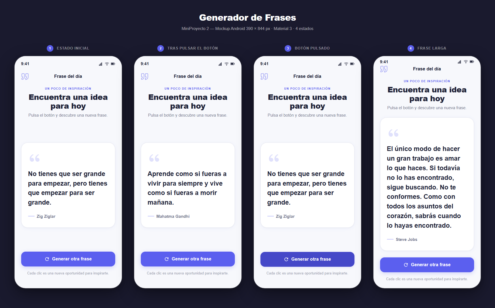

# MiniProyecto 2 — Generador de frases

Segundo proyecto de la serie **Mini proyectos Flutter**. Será una aplicación Android de una sola pantalla que mostrará una frase inspiradora y permitirá sustituirla por otra frase local al pulsar un botón.

> Estado actual: base Flutter inicializada exclusivamente para Android y diseño final de OpenDesign incorporado. La interfaz todavía no está implementada.

## Mockup



El diseño de referencia utiliza un dispositivo Android de 390 × 844 px, orientación vertical, modo claro, Material 3 y `SafeArea`. El [HTML original de OpenDesign](./docs/mockups/generador_frases_mockup.html) se conserva junto a la imagen para consultar las especificaciones completas.

## Objetivo de aprendizaje

- Representar frases y autores mediante datos locales.
- Elegir elementos de una lista de forma aleatoria.
- Actualizar la interfaz con `setState`.
- Responder al estado normal y pulsado de un botón.
- Mantener estable el layout con textos de distinta longitud.
- Extraer componentes visuales pequeños y reutilizables.

## Alcance funcional

La primera versión tendrá un flujo deliberadamente corto:

- una sola pantalla titulada **Frase del día**;
- una colección de frases definida localmente;
- una frase visible al iniciar la aplicación;
- botón **Generar otra frase** para cambiar el contenido;
- feedback visual durante la pulsación;
- sin backend, APIs externas, login, persistencia ni navegación.

## Estados de referencia

| Estado | Comportamiento esperado |
|---|---|
| Inicial | Muestra la primera frase y su autor. |
| Tras pulsar | Sustituye la frase y el autor por otro elemento local. |
| Botón pulsado | Cambia temporalmente color, sombra y elevación. |
| Frase larga | Conserva márgenes, legibilidad y acceso al botón. |

## Composición prevista

```text
QuoteAppBar
→ QuoteHeader
→ QuoteCard
  → icono, frase y autor
→ GenerateQuoteButton
→ texto de ayuda
```

| Componente | Responsabilidad | Widgets Flutter orientativos |
|---|---|---|
| `QuoteAppBar` | Icono y título de la pantalla | `Row`, `Icon`, `Text` |
| `QuoteHeader` | Introducción y jerarquía visual | `Column`, `Text` |
| `QuoteCard` | Frase y autor con longitud variable | `Container` o `Card`, `Text` |
| `GenerateQuoteButton` | Generar una nueva frase | `FilledButton`, `Icon` |

## Sistema visual

### Colores

| Rol | Valor |
|---|---|
| Fondo | `#F7F8FC` |
| Superficie | `#FFFFFF` |
| Texto principal | `#202338` |
| Texto secundario | `#74788F` |
| Principal | `#5B5FEF` |
| Principal pulsado | `#4548C8` |
| Lavanda suave | `#EEEFFF` |
| Borde | `#E7E8F0` |

### Tipografía y medidas

- Familia de referencia: Manrope.
- Título principal: 28 px y peso 800.
- Frase: 24 px, peso 600 y altura de línea 1,45.
- Márgenes laterales: 24 px.
- Tarjeta: radio de 24 px y padding de 32 × 24 px.
- Botón: 54 px de alto y radio de 16 px.

## Datos técnicos

| Propiedad | Valor |
|---|---|
| Nombre visible previsto | Generador de Frases |
| Paquete Dart | `mini_proyecto_2_generador_frases` |
| Identificador Android | `com.example.mini_proyecto_2_generador_frases` |
| Plataformas generadas | Android |
| Diseño | OpenDesign · Material 3 · 4 estados |

## Estructura objetivo

La organización será feature-first, pero proporcional al tamaño del ejercicio:

```text
lib/
├── main.dart
├── app/
│   └── quote_app.dart
└── features/
    └── quotes/
        ├── data/
        │   └── local_quotes.dart
        └── presentation/
            ├── pages/
            │   └── quote_page.dart
            └── widgets/
```

## Cómo ejecutar

```bash
flutter pub get
flutter devices
flutter run
```

La base no contiene carpetas de plataforma para iOS, web, Windows, macOS ni Linux.

## Validación

```bash
flutter analyze
```

## Próximos pasos

1. Crear el modelo local de frase y autor.
2. Preparar una lista pequeña de frases.
3. Construir la pantalla de fuera hacia dentro siguiendo el mockup.
4. Añadir la selección aleatoria con `setState`.
5. Verificar frases largas, texto grande y pantallas Android pequeñas.
6. Guardar capturas de la implementación para compararlas con el diseño.

## Licencia

Este proyecto forma parte del repositorio y utiliza su [licencia MIT](../LICENSE).
